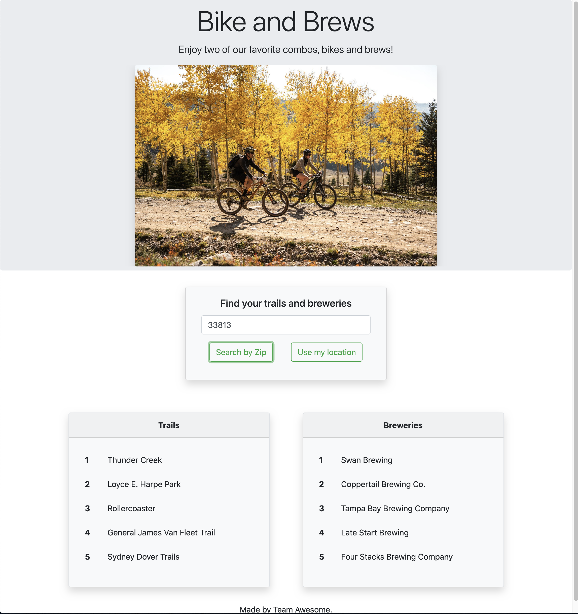

# Bikes and Brews

## Table of Contents
[Description](#description)  
[Installation](#Installation)  
[Test](#Testing)  
[Project Links](#live-Site-and-Repo)  
[License](#License)  
[Contributors](#Contributors)  

## Description
* An app that shows you five mountain bike trails and breweries based off of current location or zip code. This project uses HTML, CSS, Bootstrap, and API calls.

## Installation
* Use Live Link

## Testing
* No testing available

## Live Site and Repo
* [live Site](https://ajlaursen.github.io/Bikes-And-Brews/)
* [Repo](https://github.com/ajlaursen/Bikes-And-Brews)

## License
* 

## Contributors
* Contributor: [Alex Laursen](https://github.com/ajlaursen) Email: [contact@ajlaursen.codes](mailto:contact@ajlaursen.codes)
* Contributor: [Jasmine Teters](https://github.com/jasmineteters) Email: [jasmineteters2020@gmail.com](mailto:jasmineteters2020@gmail.com)
* Contributor: [Jorge Hernandez](https://github.com/jorgehernandez1) Email: 
* Contributor: [Taylor Cody](https://github.com/) Email: 

